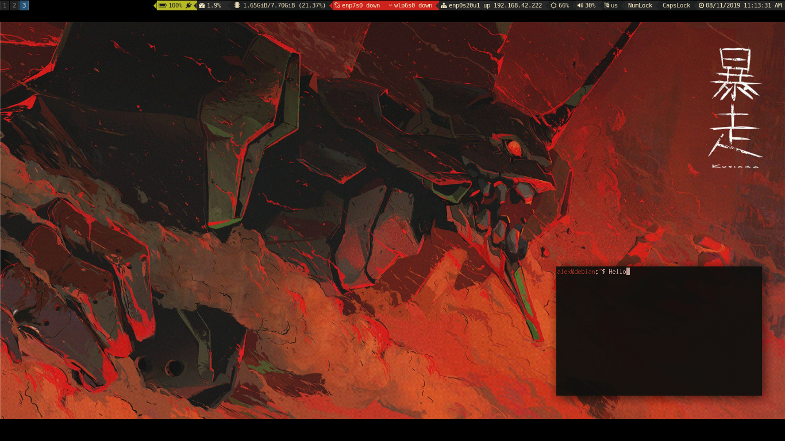

# dotfiles

Wallpaper: <https://i.imgur.com/SXqg6GH.jpg>.

## Installation

1. Install the following dependencies:
`i3-gaps urxvt compton dunst udiskie pulseaudio-utils scrot j4-dmenu-desktop pywal`.

2. Clone `git://github.com/tobi-wan-kenobi/bumblebee-status` to `~/`.

3. Generate a colorscheme with `wal -i "path/to/img.jpg"`.

3. Add `(cat ~/.cache/wal/sequences &)` to the `.bashrc`.

4. Run `xrdb ~/.Xresources` and `./init_wal.sh` before starting i3.
